# エージェントループ 内部実装ガイド

このドキュメントでは、エージェントループの内部実装フローを詳細に解説します。

> **Note**: 外部向け API は `AgentStepStream` プロトコルです。
> 内部実装の `AgentStepSequence` や `AgentLoopRunner` は直接参照できません。

## 目次

1. [アーキテクチャ概要](#アーキテクチャ概要)
2. [コンポーネント構成](#コンポーネント構成)
3. [メインループフロー](#メインループフロー)
4. [終了ポリシーシステム](#終了ポリシーシステム)
5. [状態管理](#状態管理)
6. [イベントキューイング](#イベントキューイング)
7. [エラーハンドリング](#エラーハンドリング)

---

## アーキテクチャ概要

エージェントループは以下のレイヤーで構成されています：

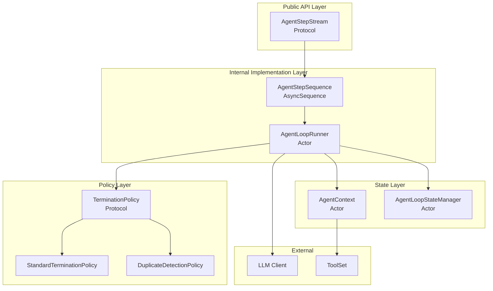

### 設計原則

- **Actor による並行安全性**: 状態管理は全て Actor で保護
- **Strategy Pattern**: 終了条件判定はポリシーとして抽象化
- **Decorator Pattern**: 重複検出は標準ポリシーをラップして拡張
- **AsyncSequence**: ストリーミング形式でステップを提供

---

## コンポーネント構成

### ファイル構成

```
Sources/LLMStructuredOutputs/Agent/
├── AgentStepStream.swift        # 公開プロトコル
├── AgentContext.swift           # メッセージ履歴・ツール管理
├── AgentTypes.swift             # 型定義（AgentStep, AgentError 等）
└── Internal/                    # 内部実装
    ├── AgentStepSequence.swift      # 内部実装の AsyncSequence
    ├── AgentLoopRunner.swift        # ループ実行 Actor
    ├── AgentTerminationPolicy.swift # 終了ポリシープロトコルと実装
    └── AgentLoopState.swift         # 状態管理 Actor
```

### コンポーネント関係図

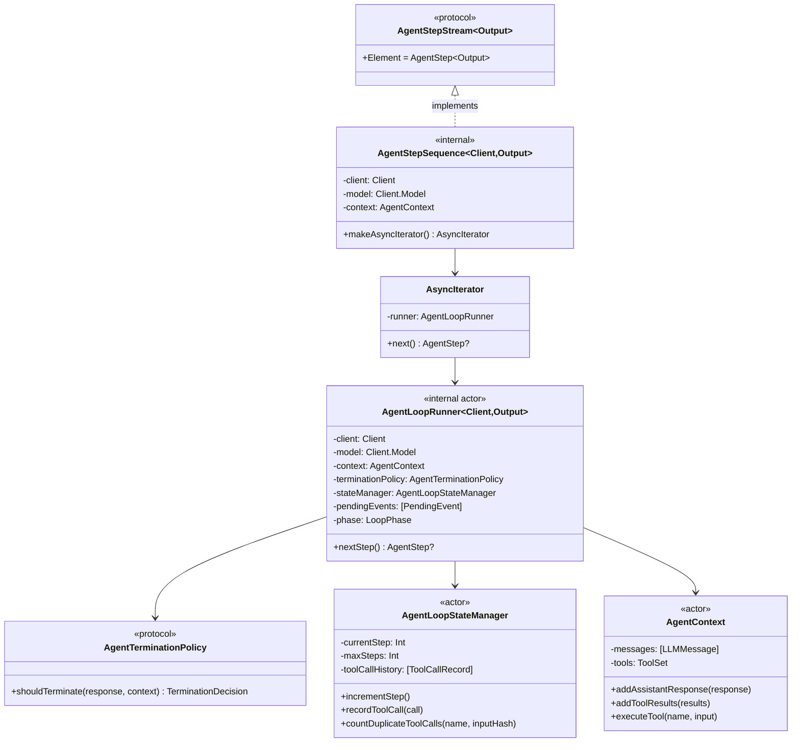

---

## メインループフロー

### nextStep() の処理フロー

`AgentLoopRunner.nextStep()` が呼ばれるたびに以下の処理が実行されます：

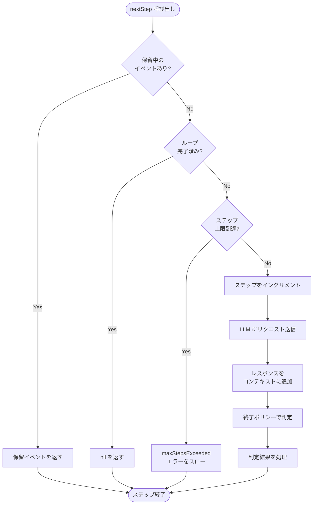

### 判定結果の処理分岐

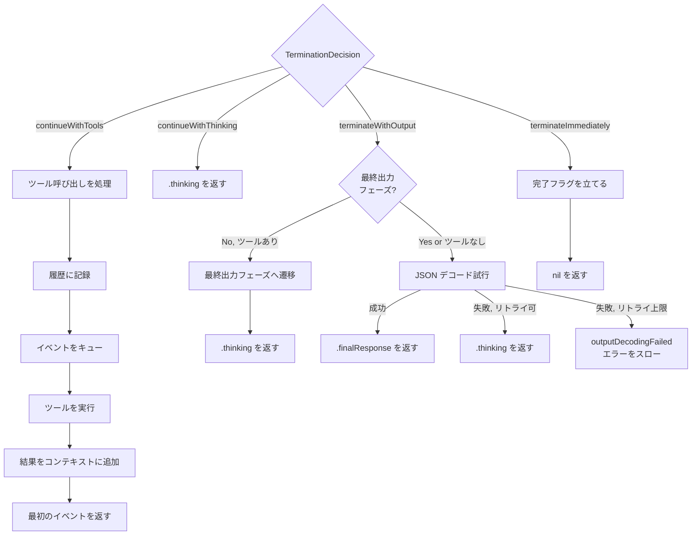

---

## 構造化出力フェーズ管理

Anthropic の推奨パターンに従い、エージェントループは2つのフェーズを持ちます：

### フェーズの種類（LoopPhase enum）

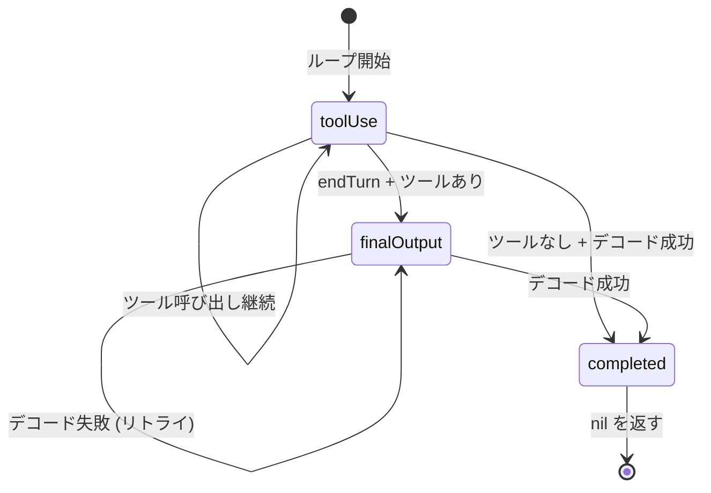

| LoopPhase | associated value | 説明 |
|-----------|------------------|------|
| `.toolUse` | なし | LLMがツールを呼び出し可能。responseSchemaは送信しない |
| `.finalOutput(retryCount: Int)` | リトライ回数 | ツールを無効化し、responseSchemaを送信。デコード再試行を追跡 |
| `.completed` | なし | ループ完了状態 |

| フェーズ | responseSchema | tools | 説明 |
|---------|---------------|-------|------|
| **ツール使用フェーズ** | 送らない | 送る | LLMがツールを自由に呼び出せる |
| **最終出力フェーズ** | 送る | 送らない | 構造化JSONを要求 |

### なぜフェーズを分けるのか

ツール使用中に `responseSchema` を送ると、以下の問題が発生します：

1. LLMがテキスト応答を返した際、JSONとして解釈できずデコードエラー
2. 「Failed to decode output」エラーが頻発

**解決策**: Anthropic の Combined Usage パターンに従い：
- ツールが使用可能な間 → `responseSchema` を送らない
- ツールなし、または最終出力フェーズ → `responseSchema` を送る

### sendRequest() の動作

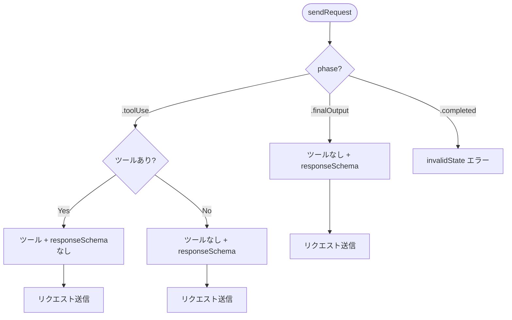

### decodeFinalOutput() の動作

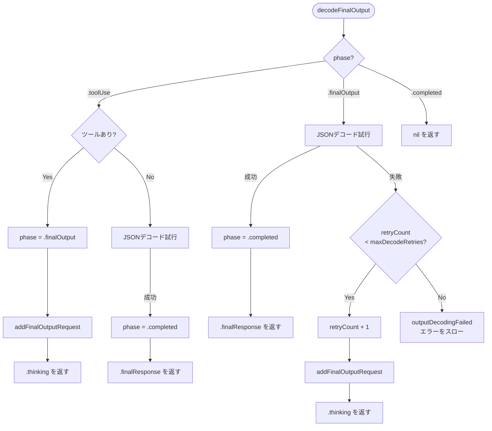

---

## 終了ポリシーシステム

### プロバイダー間の差異への対応

異なる LLM プロバイダーは `stopReason` の扱いが異なります：

| プロバイダー | ツール呼び出し時の stopReason | 備考 |
|-------------|------------------------------|------|
| **Anthropic** | `.toolUse` | 明確に区別される |
| **OpenAI** | `.toolUse` (tool_calls) | 明確に区別される |
| **Gemini** | `.endTurn` (STOP) | 関数呼び出しでも STOP を返す |

この差異に対応するため、`StandardTerminationPolicy` は `.endTurn` の場合にも
まずツール呼び出しの有無をチェックします。

### ポリシーの構造

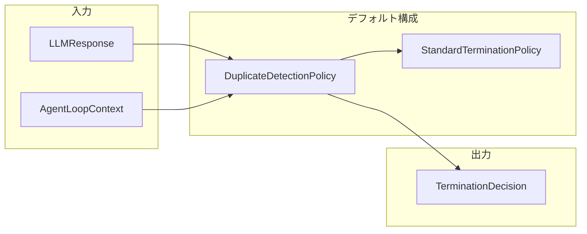

### StandardTerminationPolicy の判定ロジック

`stopReason` に基づいて終了/継続を判定します：

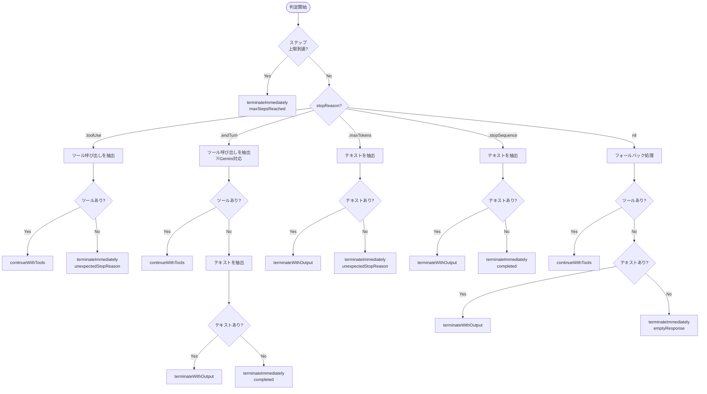

### DuplicateDetectionPolicy の処理

重複するツール呼び出しを検出して無限ループを防止します：

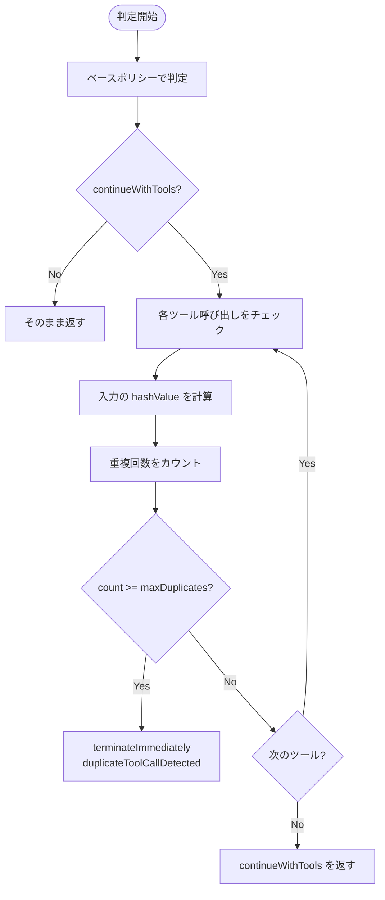

### TerminationDecision の種類

| Decision | 説明 | 次のアクション |
|----------|------|----------------|
| `continueWithTools([ToolCallInfo])` | ツール呼び出しを処理してループ継続 | ツール実行 → 次ステップ |
| `continueWithThinking` | 思考プロセスを返してループ継続 | `.thinking` を返す |
| `terminateWithOutput(String)` | テキストをデコードして終了 | `.finalResponse` を返す |
| `terminateImmediately(TerminationReason)` | 即座にループ終了 | `nil` を返す |

---

## 状態管理

### AgentLoopStateManager の役割

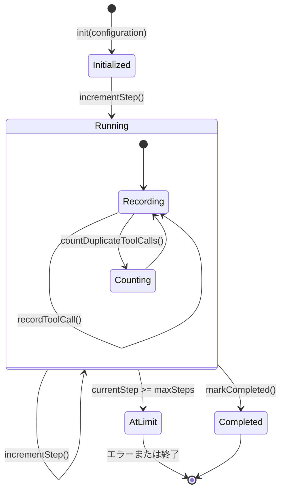

### ツール呼び出し履歴の追跡

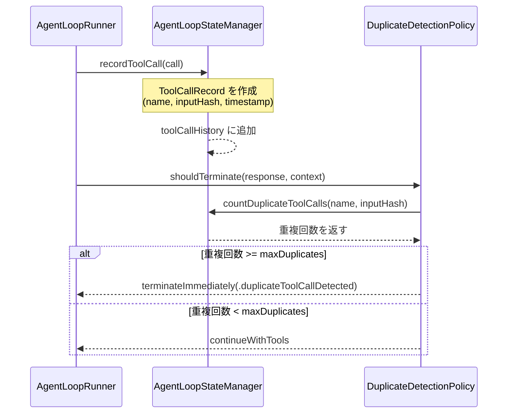

---

## イベントキューイング

ツール呼び出しが複数ある場合、イベントを順次返すためにキューイングを行います：

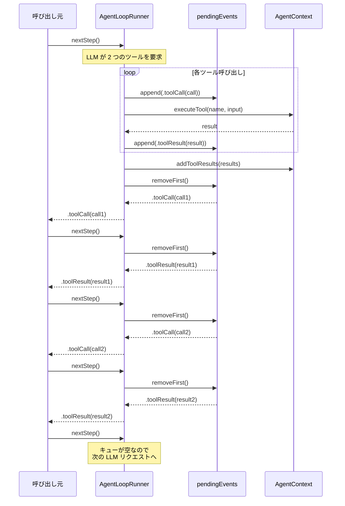

---

## エラーハンドリング

### エラーフロー図

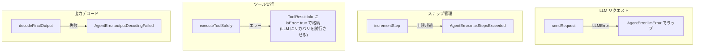

### エラー種別と発生箇所

| エラー | 発生箇所 | 説明 |
|--------|----------|------|
| `maxStepsExceeded` | `nextStep()` | ステップ数が上限に達した |
| `llmError` | `sendRequest()` | LLM API 呼び出し失敗 |
| `outputDecodingFailed` | `decodeFinalOutput()` | JSON デコード失敗 |
| `toolNotFound` | `AgentContext.executeTool()` | 指定ツールが存在しない |
| `toolExecutionFailed` | `AgentContext.executeTool()` | ツール実行中のエラー |

---

## 完全なシーケンス例

### 天気検索の完全フロー

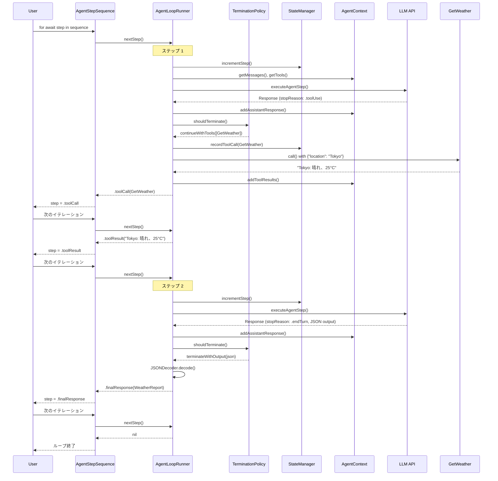

---

## 設定パラメータ

### AgentConfiguration

| パラメータ | 型 | デフォルト | 説明 |
|-----------|-----|----------|------|
| `maxSteps` | `Int` | 10 | 最大ステップ数（無限ループ防止） |
| `autoExecuteTools` | `Bool` | true | ツール自動実行の有効/無効 |
| `maxDuplicateToolCalls` | `Int` | 2 | 重複ツール呼び出しの許容回数（同一ツール・同一入力） |
| `maxToolCallsPerTool` | `Int?` | 5 | 同一ツールの最大総呼び出し回数（異なる引数でも）。`nil` で無制限 |

### 無限ループ防止メカニズム

1. **ステップ数制限**: `maxSteps` を超えると `AgentError.maxStepsExceeded`
2. **重複検出**: 同一ツール・同一引数の呼び出しが `maxDuplicateToolCalls` を超えると終了
3. **総呼び出し回数制限**: 同一ツールが `maxToolCallsPerTool` 回を超えて呼ばれると終了（異なる引数でも）
4. **stopReason 判定**: LLM の `endTurn` シグナルで正常終了
5. **デコード再試行**: JSON デコード失敗時は最大2回まで再試行（`.thinking` として返して LLM に再度要求）

---

## 参照

- [エージェントループ 使用ガイド](agent-loop.md) - 基本的な使い方
- [ツールコール](tool-calling.md) - ツール定義の詳細
- [はじめに](getting-started.md) - セットアップ手順
